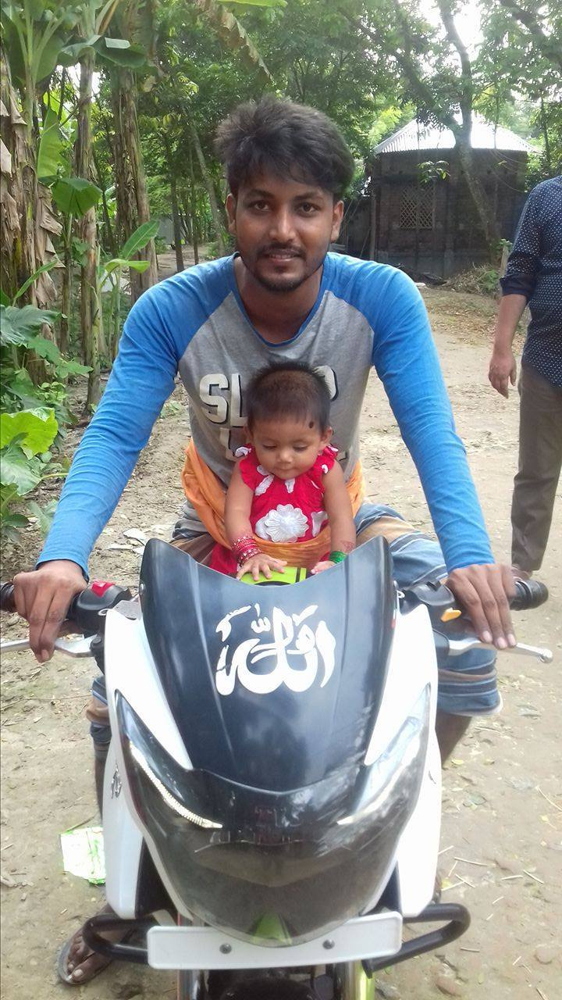

<!-- markdown tutorial -->
S M Rabiul Islam<br>
This is second line

### Head Type
---
# Head one 
## Head two 

### Head three 

#### Head four 

##### Head five

###### Head six 
<br>

<p> I am Rabiul Islam.I have completed Bs.C in CSE .I come from Jhenaidah </p>

<i>This is italic using html code </i><br>
### Italic

_This is also italic using markdown code_
<br>

### Bolt line
__This is bold using markdown code__

<del>This is also del command using md command </del>
### Delete 

~~This is del command using html~~

### inline or single

`This is inline`
<h1>This is inline</h1>

###  multiple line code
```
<html>
<body>

</body>
</html>
```

#### HTML multiple line code

```html
<html>
<body>

</body>
</html>
```
### C multiple line code
```c
# include <stdio.h>
int main(){
    printf("hello word")
    return 0;
}

```
### Order list
1. Milk
2. Tea 
   1. Green tea
   2. Black Tea
   3. Red Tea
3. Coffe

<br>

### Unorder list
- Milk
- Tea 
   - Green tea
   - Black Tea
   - Red Tea
- Coffe

### Task list
- [x] Task1
- [x] Task1
- [x] Task1
- [] Task1

### Automatic Link
http://www.facebook.com

### Disable link
` http://www.w3school `

### markdown syntax link
[W3school](http://www.w3school)
[facebook][facebooklink]

all link is here
[website link]:(http://www.studywithRabiul.com)
<br>
[facebooklink]:http://www.facebook.com

### Image syntax


<br>
😼


<br>


### table

| Name | Email |
| -----|------- |
| Rabiul Islam | Text is here |
| Rony  | Text is here also |


